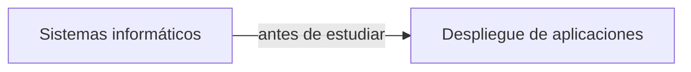

+++
title = 'Presentación'
date = 2024-10-04T18:56:41+02:00
draft = false
+++

## Módulo del segundo curso

* Es un módulo más de sistemas que de desarrollo

* Pero es fundamental para poder  hacer que nuestros desarrollos lleguen al público` 
  

* Desplegar es subir a un servidor un desarrollo de manera funcional
